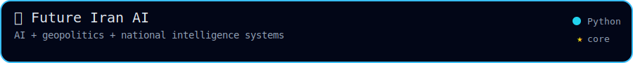
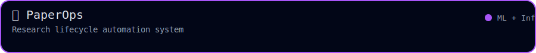
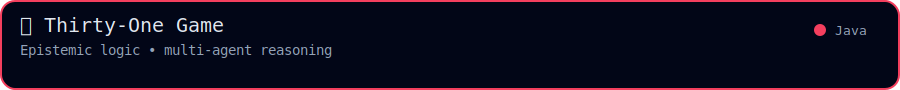
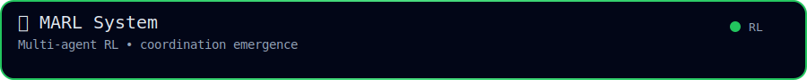
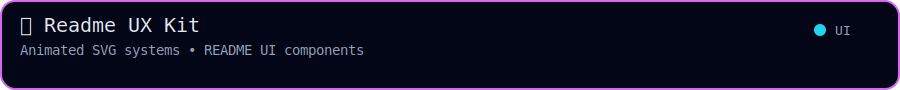
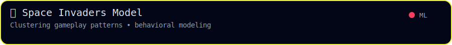

  

  
  
  

  
  
  

---

<h2 align="center">🧪 Project Highlights</h2>

<!-- Row 1 -->

  
  

<!-- Row 2 -->

  
  

<!-- Row 3 -->

  
  

---

<h2 align="center">📊 Activity</h2>

  

  
  

  

  
    

